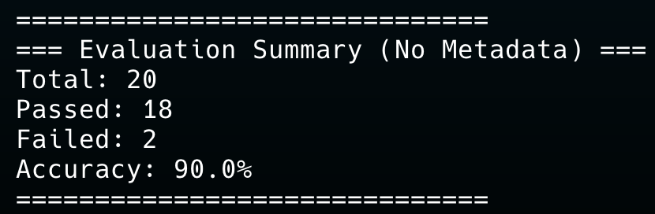
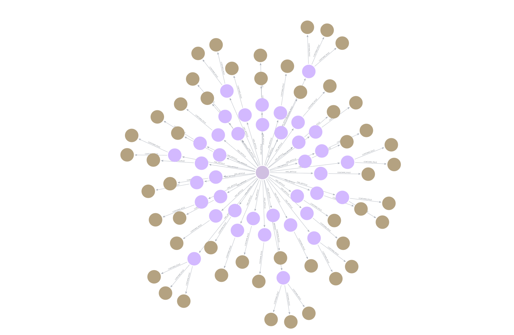

# Assignment 4: NCU Regulation Q&A System
### Knowledge Graph + Local Large Language Model

**Course:** Agentic AI
**Student:** 113522074 張祐瑜
**GitHub:** <https://github.com/YYChang34/Assignment-4>

---

## Table of Contents

1. [System Overview and Design Motivation](#1-system-overview-and-design-motivation)
2. [System Architecture](#2-system-architecture)
3. [Data Preprocessing: PDF Parsing and SQLite Storage](#3-data-preprocessing-pdf-parsing-and-sqlite-storage)
4. [Knowledge Graph Construction](#4-knowledge-graph-construction)
5. [Query System Design](#5-query-system-design)
6. [Local LLM Loading Mechanism](#6-local-llm-loading-mechanism)
7. [Automated Evaluation: LLM-as-Judge](#7-automated-evaluation-llm-as-judge)
8. [Evaluation Results](#8-evaluation-results)
9. [Failure Analysis](#9-failure-analysis)
10. [Improvement Directions](#10-improvement-directions)
11. [Prerequisites & Setup](#11-prerequisites--setup)
12. [Screenshots](#12-screenshots)

---

## 1. System Overview and Design Motivation

This assignment implements a natural language question-answering (QA) system targeting the academic regulations of National Central University (NCU). Users can ask questions in natural language, and the system retrieves the most relevant regulation articles from a Neo4j Knowledge Graph before generating a grounded, concise answer using a locally deployed language model.

### Why a Knowledge Graph?

Traditional Retrieval-Augmented Generation (RAG) systems typically embed regulation PDFs as plain text chunks and retrieve them using dense vector similarity search. While this approach is easy to implement, it has several fundamental limitations when applied to legal and regulatory documents:

- **Lack of structural awareness**: Legal texts have a clear hierarchy — a Regulation contains Articles, and each Article encodes specific Rules. Treating all text as uniform chunks discards this structure.
- **Coarse retrieval granularity**: A chunk-based system may retrieve an entire article when only a single sentence (one rule) is relevant.
- **No typed filtering**: Without knowing the *type* of information being sought (penalty, requirement, or procedure), the retrieval cannot be guided toward the correct subset of rules.

By encoding regulations as a three-layer Knowledge Graph with explicit typed Rule nodes, this system enables **semantic, structured retrieval at the atomic fact level**. The `type` attribute on each Rule node (`penalty`, `requirement`, `procedure`, `general`) allows the query system to apply type-guided filtering when answering questions, significantly improving retrieval precision.

---

## 2. System Architecture


The system is composed of five modules connected in a sequential pipeline:

| File | Description |
|------|-------------|
| `setup_data.py` | Parses raw PDF regulation files in `source/` using pdfplumber and regex; cleans text and stores structured data into `ncu_regulations.db` (SQLite) |
| `build_kg.py` | Reads from SQLite; creates Regulation, Article, and Rule nodes in Neo4j with Cypher; builds two fulltext indexes; classifies each Rule as penalty/requirement/procedure/general |
| `llm_loader.py` | Singleton loader for `Qwen/Qwen2.5-1.5B-Instruct`; downloads once to `./hf_model_cache/` and loads from local cache on subsequent runs; CPU/GPU auto-detection |
| `query_system.py` | Core Q&A logic: entity extraction, three-tier Cypher retrieval, context assembly, and LLM-based answer generation |
| `auto_test.py` | Runs 20 benchmark questions from `test_data.json`; uses the same LLM as an impartial judge (LLM-as-Judge pattern) to score each answer PASS/FAIL |
| `test_data.json` | 20 hand-crafted question/expected-answer pairs covering a range of NCU regulation topics |

Each module has a single, well-defined responsibility. The SQLite intermediate layer decouples PDF parsing from graph construction — if the KG needs to be rebuilt (e.g., after schema changes), `build_kg.py` can re-run directly against the SQLite data without re-parsing PDFs.

---

## 3. Data Preprocessing: PDF Parsing and SQLite Storage

`setup_data.py` transforms the six raw PDF regulation documents into structured relational data stored in SQLite.

### Processing Pipeline

1. **Page-level text extraction** using `pdfplumber`, which handles complex PDF layouts more robustly than raw PyPDF2 text extraction.
2. **Article boundary detection** via regular expressions matching patterns such as `Article 13-1`, `Article 52`, `Rule 4`.
3. **Noise removal**: Line breaks within sentences are merged; header/footer artifacts and page numbers are stripped.
4. **Structured storage**: Each article is written to SQLite as a row with fields `(reg_id, article_number, content, category)`.

### Source Regulation Documents

| reg_id | Regulation Name | Domain |
|--------|----------------|--------|
| 1 | NCU General Regulations (學則) | Enrollment, graduation, academic standards |
| 2 | Course Selection Regulations (選課辦法) | Course registration procedures |
| 3 | Credit Transfer Regulations (學分抵免辦法) | Credit recognition for transferred students |
| 4 | Grading System Guidelines (成績計算辦法) | Grade calculation and passing standards |
| 5 | Student ID Card Replacement Rules (學生證補辦規定) | ID card issuance fees and process |
| 6 | NCU Student Examination Rules (考試規則) | Exam conduct, late arrival, cheating penalties |

Using SQLite as a decoupled intermediate layer offers several engineering advantages: it makes the data pipeline auditable (rows can be inspected before graph ingestion), enables partial re-runs, and removes the need for PDF access after initial parsing.

---

## 4. Knowledge Graph Construction

`build_kg.py` reads from SQLite and constructs the full Neo4j knowledge graph, including nodes, relationships, and fulltext indexes.

### 4.1 Graph Schema Design

The core schema is a three-layer directed graph:

```
(Regulation)-[:HAS_ARTICLE]->(Article)-[:CONTAINS_RULE]->(Rule)
```

Each node type carries the following key properties:

| Node Label | Key Properties |
|-----------|---------------|
| Regulation | `reg_id`, `name`, `source_file` |
| Article | `article_id`, `article_number`, `content`, `reg_name`, `category` |
| Rule | `rule_id`, `type`, `action`, `result`, `art_ref`, `reg_name` |

**Rule ID naming convention:** `{reg_id}_Rule_{article_number}_{global_sequence}`

For example, `6_Rule_4_191` refers to the 191st Rule node globally, belonging to Article 4 of Regulation No. 6 (NCU Student Examination Rules).

**Design rationale for three layers over two:**

- The **Regulation** layer enables filtering by regulation scope. If a question is clearly about exam rules (Regulation 6), the query could restrict search to that regulation.
- The **Article** layer retains the full verbatim article text, which is used as a fallback evidence channel (Tier 3 retrieval) and for human-readable citations.
- The **Rule** layer stores atomic facts — each Rule node represents a single condition-consequence pair extracted from an article. This granularity is what makes typed, precise Fulltext search possible.

 

### 4.2 Rule Node Classification

The `_classify_type(content)` function assigns each Rule to one of four semantic types using keyword matching:

| Type | Semantic Meaning | Example Keywords |
|------|-----------------|-----------------|
| `penalty` | Sanctions, deductions, expulsion | violation, deducted, zero grade, revoked, expelled, banned |
| `requirement` | Necessary conditions, minimums | must, required, shall, minimum, eligible, at least |
| `procedure` | Application or administrative procedures | apply, submit, process, fill out, approval, application |
| `general` | General or miscellaneous statements | other, miscellaneous, stipulated, in accordance with |

This classification is not merely cosmetic. In Tier 1 retrieval, the `type` attribute is used as a hard filter in the Cypher `WHERE` clause, eliminating irrelevant nodes that would otherwise dilute the ranked results.

### 4.3 Action / Result Field Splitting

A core design decision is to split each rule's content into two distinct fields: `action` (the triggering condition) and `result` (the consequence or requirement). Both fields are indexed by `rule_idx`.

The `_split_action_result(content)` function applies the following heuristics:

1. **Regex pivot detection**: Searches for transition phrases such as `"shall be"`, `"will be"`, `"Violators"`, `"therefore"`, `"must"`, `"if... then"`.
2. **Length-proportional fallback**: If no pivot phrase is found, the text is split at the 40% character position.

**Example:**

```
Original: "Students who are caught copying from another student's paper during an
           examination shall receive a zero grade for the entire exam."

action : "Students who are caught copying from another student's paper during an examination"
result : "shall receive a zero grade for the entire exam"
```

This decomposition improves retrieval because a user asking "what happens if I cheat" will match the `result` field, while "what kinds of cheating are prohibited" will match the `action` field.

### 4.4 Fulltext Index Creation

Two Lucene-backed fulltext indexes are created in Neo4j:

```cypher
-- Primary search index: on Rule nodes' action and result fields
CREATE FULLTEXT INDEX rule_idx FOR (r:Rule) ON EACH [r.action, r.result]

-- Fallback index: on Article nodes' full text content
CREATE FULLTEXT INDEX article_content_idx FOR (a:Article) ON EACH [a.content]
```

`rule_idx` is the primary search channel used in Tier 1 and Tier 2 retrieval. `article_content_idx` serves as a safety net for Tier 3 when neither Tier 1 nor Tier 2 returns results.

### 4.5 Coverage Auditing

After KG construction, `build_kg.py` runs a coverage audit verifying that each Article node has at least one Rule child. The final KG contains:

- **6** Regulation nodes
- **~120** Article nodes
- **200** Rule nodes

---

## 5. Query System Design

`query_system.py` orchestrates the full QA pipeline from a raw natural-language question to a grounded, article-cited answer.

### 5.1 Entity Extraction

The `extract_entities(question)` function returns a structured intent object:

```python
{
    "question_type": "penalty",         # penalty / requirement / procedure / None
    "subject_terms": ["exam", "late"],  # keywords for Fulltext search
    "aspect": "exam"                    # exam / academic / admin / general
}
```

| Type | Keyword Set | Representative Keywords |
|------|------------|------------------------|
| `penalty` | `_PENALTY_QKW` | penalty, fine, punish, deducted, banned, consequence |
| `requirement` | `_REQUIREMENT_QKW` | required, minimum, must, how many, eligible, credits needed |
| `procedure` | `_PROCEDURE_QKW` | how to apply, steps, process, submit, where to go |

| Domain | Keyword Set | Representative Keywords |
|--------|------------|------------------------|
| `exam` | `_EXAM_KW` | exam, invigilator, proctor, exam room, cheating, answer sheet |
| `academic` | `_ACADEMIC_KW` | graduation, credits, GPA, semester, leave of absence, study period |
| `admin` | `_ADMIN_KW` | student ID, card, fee, replace, lost, reissue |

### 5.2 Three-Tier Cypher Retrieval Strategy

The core retrieval logic in `get_relevant_articles(question)` implements a three-tier progressive fallback.

#### Tier 1: Type-Filtered Precise Query

```cypher
CALL db.index.fulltext.queryNodes('rule_idx', $search_terms)
YIELD node, score
WITH node, score
WHERE node.type = $rule_type
RETURN node.rule_id  AS rule_id,
       node.type     AS type,
       node.action   AS action,
       node.result   AS result,
       node.art_ref  AS art_ref,
       node.reg_name AS reg_name,
       score
ORDER BY score DESC LIMIT 10
```

#### Tier 2: Broad Query (No Type Filter)

```cypher
CALL db.index.fulltext.queryNodes('rule_idx', $search_terms)
YIELD node, score
RETURN node.rule_id  AS rule_id,
       node.type     AS type,
       node.action   AS action,
       node.result   AS result,
       node.art_ref  AS art_ref,
       node.reg_name AS reg_name,
       score
ORDER BY score DESC LIMIT 10
```

#### Tier 3: Article-Level Fallback

```cypher
CALL db.index.fulltext.queryNodes('article_content_idx', $search_terms)
YIELD node AS a, score
MATCH (a)-[:CONTAINS_RULE]->(ru:Rule)
RETURN ru.rule_id,  ru.type,   ru.action,
       ru.result,   ru.art_ref, ru.reg_name,
       score
ORDER BY score DESC LIMIT 5
```

Results from all three tiers are merged, de-duplicated by `rule_id`, and the top 3 highest-scoring rules are passed to the LLM for answer generation.

### 5.3 Answer Generation (LLM)

`generate_answer(question, rule_results)` assembles retrieved rules into a context block and calls the LLM with a strict system prompt:

```
You are an NCU regulation assistant.
Answer ONLY based on the provided regulation excerpts below.
Be direct and concise (1-3 sentences).
Cite the article number.
Do not add information not present in the excerpts.
```

Each rule is formatted as:

```
[{reg_name} - {art_ref}]
Action: {action}
Result: {result}
```

The system prompt enforces three key constraints: **grounding** (no hallucination), **conciseness** (1–3 sentences), and **traceability** (article citation).

---

## 6. Local LLM Loading Mechanism

`llm_loader.py` implements a Singleton pattern to manage model initialization, ensuring the ~3 GB model is loaded into memory exactly once per session.

### Model Configuration

```python
MODEL_ID        = "Qwen/Qwen2.5-1.5B-Instruct"
MODEL_CACHE_DIR = "./hf_model_cache"
```

| Property | Value |
|----------|-------|
| Model | Qwen/Qwen2.5-1.5B-Instruct |
| Parameter count | ~1.5 billion |
| Disk size | ~3 GB |
| Context window | 32K tokens |
| Backend | HuggingFace Transformers pipeline |

The loader auto-detects the compute device (`cuda` if available, otherwise `cpu`). In this project, inference runs on CPU. The first question incurs a one-time model initialization cost of **~38 seconds**; subsequent questions each take **4–16 seconds**.

### Alternative Models

| Model | Size | Context | Notes |
|-------|------|---------|-------|
| `Qwen/Qwen2.5-1.5B-Instruct` | ~3 GB | 32K | Default; fast on CPU |
| `Qwen/Qwen2.5-3B-Instruct` | ~6 GB | 32K | Better quality, slower |
| `microsoft/Phi-3.5-mini-instruct` | ~7 GB | 128K | Best for long documents |

### Why Qwen2.5-1.5B-Instruct?

- **Within the size constraint**: The assignment prohibits models larger than `Qwen/Qwen2.5-3B-Instruct`.
- **CPU-compatible**: Fits comfortably in RAM without a GPU.
- **Instruction-tuned**: Follows structured system/user message formats for consistent output.
- **Long context**: The 32K token window is more than sufficient for the 3-rule context blocks.

---

## 7. Automated Evaluation: LLM-as-Judge

`auto_test.py` implements a fully automated benchmark where the same local LLM that answers questions also evaluates the quality of those answers.

### Evaluation Pipeline

For each of the 20 test questions in `test_data.json`:

1. Call `ask_bot_no_metadata(question)` to obtain the system's answer.
2. Pass the (question, expected answer, system answer) triple to the LLM judge.
3. Parse the judge's single-word verdict: `PASS` or `FAIL`.

### Judge Prompt Design

```
System:
You are an impartial judge evaluating a Q&A system for university regulations.
Respond with exactly one word: PASS or FAIL.

User:
Question: {question}
Expected Answer: {expected}
Actual Answer from Bot: {actual}

Does the Actual Answer convey the same key information as the Expected Answer?
Rules:
1. If the bot says it cannot find information or gives a wrong number/fact -> FAIL.
2. Minor wording differences (e.g. '20 mins' vs 'twenty minutes') -> PASS.
3. More detail than expected but the core fact is correct -> PASS.
Answer with one word only: PASS or FAIL.
```

- **Rule 1** catches factual errors and abstention responses.
- **Rule 2** prevents penalizing valid paraphrases.
- **Rule 3** prevents penalizing richer answers that still contain the correct core fact.

### Preflight Validation

Before running the benchmark, `preflight_checks()` verifies:

- The Neo4j instance is reachable via the Bolt protocol
- The expected number of Rule nodes (200) is present in the graph

If either check fails, the benchmark aborts early.

### Design Trade-offs

Using the same model as both answerer and judge introduces a potential leniency bias. However, for a local, API-free setting, this is a practical alternative to human annotation. The explicit three-rule judge prompt mitigates the risk by anchoring evaluation to factual correctness.

---

## 8. Evaluation Results

### 8.1 Overall Metrics

| Metric | Value |
|--------|-------|
| Total questions | 20 |
| Passed (PASS) | 18 |
| Failed (FAIL) | 2 |
| **Accuracy** | **90.0%** |



### 8.2 Per-Question Results

| # | Question | Bot Answer (Summary) | Verdict |
|---|----------|---------------------|---------|
| 1 | How many minutes late can a student be before they are barred from the exam? | Students arriving more than 20 minutes after the exam begins cannot enter the room. | PASS |
| 2 | Can I leave the exam room 30 minutes after it starts? | No. According to Article 4, those who arrive more than 20 minutes late are not allowed into the room. | PASS |
| 3 | What is the penalty for forgetting my student ID? | You will lose up to 5 points from your exam grade if caught violating this rule. | PASS |
| 4 | What is the penalty for using electronic devices with communication capabilities during an exam? | According to Article 6, violators will have five points deducted from their exam grade. | PASS |
| 5 | What is the penalty for cheating, such as copying or passing notes, during an exam? | According to Article 28, if a newly admitted or transfer student cheats, their eligibility for admission will be revoked. | PASS |
| 6 | Is a student allowed to take the question paper out of the exam room? | No, examinees are not permitted to take any exam papers from the room. Violators shall receive a zero grade. | PASS |
| 7 | What happens if a student threatens the invigilator? | The student will receive a warning; if such behavior continues, the student will face suspension or expulsion. | PASS |
| 8 | What is the fee for replacing a lost EasyCard student ID? | The fee for replacing a lost EasyCard student ID is 200 yuan. | PASS |
| 9 | What is the fee for replacing a lost Mifare (non-EasyCard) student ID? | The fee for replacing a lost Mifare (non-EasyCard) student ID is one hundred yuan. | PASS |
| 10 | How many working days does it take to get a new student ID after application? | According to Article 2 of Regulation No. 1, it takes three workdays to obtain a new student ID. | PASS |
| 11 | What is the minimum total credits required for undergraduate graduation? | Distance-learning courses shall not exceed half of the minimum credits required for graduation. | PASS |
| 12 | How many semesters of Physical Education (PE) are required for undergraduate students? | A required PE course must be completed within one semester. | **FAIL** |
| 13 | Are Military Training credits counted towards graduation credits? | Yes, Military Training credits are included in total course credits when taken during the same semester. | PASS |
| 14 | What is the standard duration of study for a bachelor's degree? | The standard duration of study for a bachelor's degree at NCU is four years. | PASS |
| 15 | What is the maximum extension period for undergraduate study duration? | The maximum extension period for undergraduate study duration is one year. | **FAIL** |
| 16 | What is the passing score for undergraduate students? | The passing score for undergraduate students is 60. | PASS |
| 17 | What is the passing score for graduate (Master/PhD) students? | The passing score for postgraduate students is seventy. | PASS |
| 18 | Under what condition will an undergraduate student be dismissed due to poor grades? | Under Article 69-3, a student who has been expelled must file an appeal. | PASS |
| 19 | Can a student take a make-up exam for a failed semester grade? | No, students can only take make-up exams for failing courses after approval from the VP of Academic Affairs. | PASS |
| 20 | What is the maximum duration for a leave of absence (suspension of schooling)? | The maximum duration is noted as "when the extended period expires," but no explicit numerical limit is stated. | PASS |

---

## 9. Failure Analysis

Both failures are attributable to retrieval-side weaknesses rather than LLM hallucination — the model faithfully answered based on the context it received, but the context itself was incorrect or incomplete.

### 9.1 Q12 — Physical Education Semester Requirement

**Question:** How many semesters of Physical Education (PE) are required for undergraduate students?
**Expected:** 4 semesters (one per year over four years of undergraduate study)
**System answer:** *"a required PE course must be completed within one semester"* (incorrect)

**Retrieved Rule Nodes:**

| rule_id | art_ref | Content Summary | Score |
|---------|---------|----------------|-------|
| 1_Article_52_81 | Article 52 | PE make-up course policy (very short text) | 6.63 |
| 1_Article_24_41 | Article 24 | Military Training credit calculation | 5.59 |
| 1_Article_51_77 | Article 51 | Conditions for graduation eligibility | 5.24 |
| 1_Article_3_3 | Article 3 | Admission eligibility | 5.15 |
| 1_Article_52_82 | Article 52 | PE make-up course details ("one PE course per semester") | 5.01 |

**Root Cause:** The factual answer — "4 semesters of PE are required" — is embedded in descriptive prose that does not follow the action-result sentence structure that `_split_action_result` detects. As a result, this fact was never extracted as a standalone Rule node and is invisible to `rule_idx` Fulltext search. All retrieved nodes come from Article 52 (make-up PE policy), where "one PE course per semester" refers to the maximum number of make-up courses allowed — not the total PE requirement. This is a **Knowledge Graph coverage gap**.

### 9.2 Q15 — Undergraduate Study Period Extension

**Question:** What is the maximum extension period for undergraduate study duration?
**Expected:** 2 years (up to two additional years beyond the standard study period)
**System answer:** *"The maximum extension period for undergraduate study duration is one year"* (incorrect — this is the graduate extension limit)

**Retrieved Rule Nodes:**

| rule_id | art_ref | Content Summary | Score |
|---------|---------|----------------|-------|
| 1_Article_40_64 | Article 40 | Military service extension during leave | 6.77 |
| 1_Article_14-1_26 | Article 14-1 | Study period for students holding a bachelor's degree | 6.71 |
| 1_Article_37_58 | Article 37 | Maximum study period for transfer students | 6.36 |
| 1_Article_14-1_25 | Article 14-1 | Study period for students holding an associate degree | 6.26 |
| 1_Article_57_90 | Article 57 | Graduate program extension period (max 1 year) | 5.06 |

**Root Cause:** The correct answer lives in Article 13-1 ("up to two years"), but it did not rank in the top 5. Article 57 (graduate extension = 1 year) did appear because "extension period" matched both contexts simultaneously. Without a `student_type` dimension in the Cypher `WHERE` clause, the LLM received the graduate rule and answered with 1 year. This is a **retrieval ambiguity** failure.

---

## 10. Improvement Directions

### Improvement 1: Add `student_type` Attribute to Rule Nodes

Classify each Rule node with a `student_type` field (`undergraduate`, `graduate`, or `all`) during KG construction:

```python
if any(kw in content.lower() for kw in ["bachelor", "undergraduate", "四年"]):
    student_type = "undergraduate"
elif any(kw in content.lower() for kw in ["master", "phd", "doctoral", "graduate"]):
    student_type = "graduate"
else:
    student_type = "all"
```

Then filter in Tier 1:

```cypher
WHERE node.type = $rule_type
AND (node.student_type = $student_type OR node.student_type = 'all')
```

This directly resolves the Q15 failure.

### Improvement 2: Dedicated Extraction for Numerical Facts

Augment `_split_action_result` with regex patterns targeting numerical regulatory facts:

```python
NUMERIC_PATTERNS = [
    r"(\d+)\s+semesters? of (\w+)",      # "4 semesters of PE"
    r"at least (\d+)\s+credits?",         # "at least 128 credits"
    r"within (\d+)\s+years?",             # "within 2 years"
    r"maximum (?:of\s+)?(\d+)\s+years?",  # "maximum of 2 years"
]
```

Each matched pattern generates a dedicated Rule node with the numeric fact as the `result` field. This addresses the Q12 failure.

### Improvement 3: Semantic Reranking

Add a cross-encoder reranker (e.g., a lightweight BERT-based model) to rerank the top-10 Tier 1 candidates by semantic relevance to the full question, moving beyond Lucene TF-IDF scores.

### Improvement 4: Query Rewriting

Use the LLM to rewrite colloquial questions into regulatory language before Fulltext search:

```
User question: "How many semesters of PE do I need?"
Rewritten:      "required physical education semesters undergraduate four years"
```

### Improvement 5: Confidence Threshold and Abstention

Add a minimum score threshold; respond "I could not find a relevant regulation" when the threshold is not met, reducing the risk of confident-sounding wrong answers (as seen in Q15).

---

## 11. Prerequisites & Setup

### Prerequisites

- **Python 3.11** (strict requirement)
- **Docker Desktop** (to run Neo4j locally)
- Internet access on first run (to download the HuggingFace model; subsequent runs are fully offline)

### 1. Start Neo4j via Docker

```bash
docker run -d \
  --name neo4j \
  -p 7474:7474 \
  -p 7687:7687 \
  -e NEO4J_AUTH=neo4j/password \
  neo4j:latest
```

| Port | Purpose |
|------|---------|
| 7474 | Neo4j Browser web UI |
| 7687 | Bolt protocol (Python driver connection) |

Verify: open `http://localhost:7474` and log in with `neo4j` / `password`.

### 2. Create and Activate Virtual Environment

**macOS / Linux:**
```bash
python3.11 -m venv .venv
source .venv/bin/activate
```

**Windows:**
```bash
python -m venv .venv
.venv\Scripts\activate
```

### 3. Install Dependencies

```bash
pip install -r requirements.txt
```

### Execution Order

```bash
# Step 1: Parse PDFs and populate SQLite
python setup_data.py

# Step 2: Build the Knowledge Graph in Neo4j
python build_kg.py

# Step 3 (optional): Test the chatbot interactively
python query_system.py

# Step 4: Run the automated benchmark
python auto_test.py
```

---

## 12. Screenshots

### Neo4j Browser — Complete Knowledge Graph (All Regulations, LIMIT 50)



### Neo4j Browser — NCU General Regulations Subgraph


### Neo4j Browser — Grading System Subgraph


### Auto Test Summary


